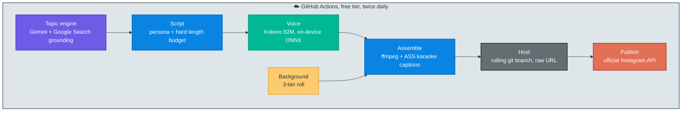

*I replaced myself with a $0 pipeline that scripts, voices, renders and publishes reels to Instagram twice a day, with no human in the loop. This is the day-zero story. The data comes in part two.*

## The before photo

My Instagram page [@mediamonkey.ai](https://www.instagram.com/mediamonkey.ai/) had 157 posts and zero followers.

Read that again. Not "a few followers". Zero. A year of AI-generated content, an ElevenLabs bill, a Python pipeline with Ken Burns zooms over AI images, scheduled three times a day on GitHub Actions. The machine worked perfectly. Nobody came.

157 posts is a big enough sample to stop blaming luck. Volume wasn't the problem. The format was. So last weekend I rebuilt the whole thing from zero, with two rules that sound like constraints and turned out to be the entire strategy.

## Rule 1: never rent, always own

You've seen the accounts this genre is famous for. A cartoon dad's cloned voice explains binary search over ripped Subway Surfers footage. Some of those pages have hundreds of thousands of followers.

They're also rented houses. The voice belongs to a voice actor, the character belongs to a studio, the gameplay belongs to whoever recorded it. Every one of those accounts lives one takedown wave away from zero, and the ones that grow big enough to matter are exactly the ones that get noticed. You can't sell it, you can't put your name on it, you can't even be sure it exists next month.

So rule one: **every pixel and every sample in every reel is either generated by me or licensed for commercial use, with the license logged per file.** Not because I'm noble. Because I'm building an asset, not a lottery ticket.

## Rule 2: no humans in the loop

The old pipeline needed me to be alive. The new one doesn't. From topic to published reel, zero clicks:

A reel renders in about 30 seconds on my laptop and about 3 minutes on a free ubuntu runner. The full run, including Instagram's transcode, is under 6 minutes. The bill is zero: Gemini free tier for ~120 words of script, Kokoro runs local, ffmpeg is ffmpeg, GitHub Actions is free for the minutes this needs, and the Instagram Graph API costs nothing because posting your own content is what it's for.

Everything below is the interesting part: what broke, and what the constraint forced me to invent.

## The voice: measured, not vibed

No cloned voices means an open TTS model. [Kokoro](https://huggingface.co/onnx-community/Kokoro-82M-v1.0-ONNX) is 82M parameters, Apache-licensed, and runs on CPU via onnxruntime, 88 MB of model for the whole voice stack.

Which of its stock voices though? I couldn't listen to them in CI, so the pipeline measures instead: words per second and RMS energy per candidate. `af_bella` won at 3.38 words/sec with the highest RMS (0.0805); `am_michael` sounded measured and slow at 3.10 and the lowest energy. The choice is a config key, and `npm run voices` regenerates the comparison table.

Two production lessons the model card doesn't tell you: raw Kokoro output sits around -25 dB mean volume, which reads as low-energy in a feed full of loudness-warred audio, so everything passes through `loudnorm` to -14 LUFS. And the script length budget lives in code, not in the prompt, because the LLM reliably overshoots a "45 seconds max" instruction into 56-second reels. Prompts suggest. Validators enforce.

## The backgrounds: the constraint becomes the moat

This genre runs on background dopamine: something must always be about to happen. The rented-house accounts steal gameplay for this. Owning every pixel forced a better answer: **procedural physics with a fresh random seed for every reel.**

A ball bounces inside concentric rotating rings, slips through a gap, the ring shatters, the ball speeds up, new rings spawn forever. A marble cascade rains through a peg pyramid into buckets with a live counter. Each is a self-contained HTML page; a recorder drives headless Chromium frame by frame over CDP and pipes JPEGs into ffmpeg's image2pipe. Because the pages advance one fixed physics step per frame, capturing 30fps with two steps per frame produces footage identical to a 60fps capture at half the screenshot cost. That one observation halved render time.

The part I like most: no two posts ever share a background. The seed is in the filename. Accounts that rip clips physically cannot say that.

Tier two is licensed "oddly satisfying" stock via the Pexels API, and tier three is public domain (NASA, Internet Archive). Which produced my favorite bug of the build: the first harvest run proudly delivered four unusable clips. A near-black starfield, two clips with burned-in title bars, a 352x240 upscale. Metadata scoring can't see the picture. The fix is a measured screen: mean luma, frame-to-frame motion, and a static-edge ratio, because edge energy that moves with the frame is texture, while edge energy that stays put is a logo or a subtitle bar. It agreed with my eye on all eight test clips and now gates every ingest.

The weights: 50% seeded physics, 35% harvested, 15% public domain, and an empty tier hands its weight to the others, so the CI runner (which carries only the committed physics loops) degrades gracefully instead of failing.

## The publish: the sanctioned way

My old pipeline posted through Instagram's private web API with a stored password. It worked, the way driving without a license works. The rebuilt one uses the official **Instagram API with Instagram login**: you attach your creator account to a Meta app, it issues a 60-day token, and publishing is a three-call dance: create a media container from a public video URL, poll until Meta finishes transcoding, publish.

Small honest war stories from getting there:

- The video URL must be public. GitHub gives you free hosting for this if you're shameless enough: the workflow force-pushes each reel to a rolling `reels` branch and hands Meta the `raw.githubusercontent.com` URL. The branch keeps the last ten and eats its own history.
- My hosting step originally swept the working tree to build that orphan branch before copying the reel out of it. It deleted its own payload. Stash first, sweep second.
- ubuntu runners have no `ffprobe` (the npm ffmpeg-static ships ffmpeg only), no display fonts (an OFL face is committed and handed to libass via fontsdir), and every run re-downloads the 88 MB voice model unless you cache it.
- 60-day tokens sound like a chore until you read the refresh endpoint: each refresh grants a fresh 60 days. A Monday cron refreshes the token and writes it back to the repo secret, so it's effectively immortal. The one catch: the default Actions token can't modify secrets, so the write-back needs a one-time fine-grained PAT.

The publisher itself is ~90 lines, [publish.mjs](https://github.com/anzal1/media-monkey/blob/main/factory/publish.mjs), and it skips politely when secrets are absent so the pipeline was testable before the account was wired.

## The part nobody in this genre does

Every beat in every script must carry a source-checkable claim, and the prompt bans invented numbers outright. Every clip's origin and license live in [sources.json](https://github.com/anzal1/media-monkey/blob/main/assets/clips/sources.json), and a clip that requires attribution gets its credit line appended to the caption automatically, by code, not by memory.

This sounds like compliance. It's actually positioning. The faceless-reel economy is drowning in fake facts and stolen footage, which means reliability is the one differentiator that compounds instead of decaying. Being the account that never gets a community note is a moat you can't buy.

## Day zero

The baseline this experiment starts from, captured by the pipeline's own analytics (the same token grants insights access, so a weekly job snapshots every reel's views, reach, saves and average watch time into a history file and opens a report issue):

| metric | value |
|---|---|
| followers | 1 |
| posts (old era) | 157 |
| best reel ever (old era) | 296 views |
| cost per month | $0 |
| human minutes per reel | 0 |

The first machine-published reel went up today: marble physics behind the line "your brain loves new stuff. really loves it.", which is either a caption or a diagnosis of the entire genre.

Two reels a day, every day, from here. In 30 days the history file will say whether owned pixels and true facts can compete with cloned cartoon voices, and part two will publish the graphs either way. If it flops, the post-mortem will at least have real numbers, which is more than the first 157 posts left me.

The whole factory is open source: [github.com/anzal1/media-monkey](https://github.com/anzal1/media-monkey). The monkey is at [@mediamonkey.ai](https://www.instagram.com/mediamonkey.ai/), posting whether or not I'm awake.
